# Data Model — ruuma

**Version:** 1.0
**Date:** 2 August 2026

PostgreSQL 18. `gorm` ORM (raw SQL on money and capacity paths). UUIDv7 primary
keys (BR-1.2.1). Money as `BIGINT` in whole rupiah (BR-1.1.1). Timestamps
`timestamptz` in UTC (BR-1.3.1); business dates as `DATE` in the store's
timezone (BR-1.3.3). **The numbered migrations are the source of truth** — gorm
models map onto them and `AutoMigrate` is never used.

Conventions applied to every table: `id UUID PRIMARY KEY`, `created_at`/
`updated_at TIMESTAMPTZ NOT NULL DEFAULT now()`, and — for store-scoped tables —
`store_id UUID NOT NULL REFERENCES stores(id)` with an index and **per-store**
uniqueness (BR-2.1.1, BR-2.7.8).

---

## 1. ERD

```mermaid
erDiagram
  STORES ||--o{ STORE_HOURS : "opens per weekday/mode"
  STORES ||--o{ STORE_DATE_OVERRIDES : "per-date schedule"
  STORES ||--o{ STORE_BLACKOUT_DATES : "closed dates"
  STORES ||--o{ STORE_FULFILMENT_MODES : supports
  STORES ||--o{ STORE_BANK_ACCOUNTS : "receives transfers"
  STORES ||--o{ STORE_PARAMETERS : overrides
  STORES ||--o{ STORE_MENU_OVERRIDES : "price/availability"
  STORES ||--o{ ITEM_86S : "out of stock"
  STORES ||--o{ ITEM_DAILY_STOCK : "counts down"
  STORES ||--o{ SLOTS : materialises
  STORES ||--o{ ORDERS : receives
  STORES ||--o{ DELIVERY_ZONES : "phase 2"
  STORES ||--o{ STAFF_STORE_ASSIGNMENTS : "staffed by"
  USERS ||--o{ STAFF_STORE_ASSIGNMENTS : "assigned to"
  CUSTOMERS ||--o{ CUSTOMER_IDENTITIES : "signs in with"
  CUSTOMERS ||--o{ ADDRESSES : "phase 2"
  CUSTOMERS ||--o{ FAVOURITES : saves
  CUSTOMERS ||--o{ ORDERS : places
  CATEGORIES ||--o{ MENU_ITEMS : groups
  MENU_ITEMS ||--o{ OPTION_GROUPS : configures
  OPTION_GROUPS ||--o{ OPTION_CHOICES : offers
  MENU_ITEMS ||--o{ ITEM_AVAILABILITY_RULES : restricts
  MENU_ITEMS ||--o{ STORE_MENU_OVERRIDES : "overridden by"
  MENU_ITEMS ||--o{ ORDER_LINES : "snapshotted into"
  SLOTS ||--o{ ORDERS : "booked by"
  ORDERS ||--o{ ORDER_LINES : contains
  ORDER_LINES ||--o{ ORDER_LINE_OPTIONS : "chosen options"
  ORDERS ||--o{ ORDER_EVENTS : "append-only history"
  ORDERS ||--o{ PAYMENTS : "paid by"
  PAYMENTS ||--o{ PAYMENT_EVENTS : "append-only history"
  PROMOTIONS ||--o{ PROMOTION_STORES : "scoped to"
  PROMOTIONS ||--o{ PROMOTION_CATEGORIES : restricted
  PROMOTIONS ||--o{ PROMOTION_REDEMPTIONS : redeemed
  ORDERS ||--o| PROMOTION_REDEMPTIONS : uses
```



Supporting tables with no strong parent: `sys_parameters`, `audit_log`,
`otp_codes`, `verification_tokens`, `refresh_tokens`, `notifications`,
`idempotency_keys`.

> **Deviation, deliberate:** the generic scaffold listed `slot_templates` and
> `service_days`. Those are folded into `store_hours` + `store_date_overrides` +
> `store_parameters`, which already express "what this store does on this
> weekday, for this mode, at this slot length". Two tables describing the same
> truth would drift; `slots` is materialised from these (BR-2.3.3).

---

## 2. Tables

### 2.1 `sys_parameters` — group configuration (BR-1.4)

```sql
CREATE TABLE sys_parameters (
  id          UUID PRIMARY KEY,
  key         TEXT NOT NULL UNIQUE,                  -- e.g. 'pricing.tax_bps'
  value       TEXT NOT NULL,                         -- stored as text; typed on read
  data_type   TEXT NOT NULL DEFAULT 'string'
              CHECK (data_type IN ('string','int','bool','decimal','json')),
  description TEXT,
  is_secret   BOOLEAN NOT NULL DEFAULT false,        -- masked in UI/logs (BR-1.4.3)
  is_store_overridable BOOLEAN NOT NULL DEFAULT false, -- BR-1.4.4
  updated_by  UUID REFERENCES users(id),
  created_at  TIMESTAMPTZ NOT NULL DEFAULT now(),
  updated_at  TIMESTAMPTZ NOT NULL DEFAULT now()
);
CREATE INDEX idx_sys_parameters_key ON sys_parameters (key);
```

Key groups in use: `scheduling.*`, `orders.*`, `pricing.*`, `fulfilment.*`,
`auth.*`, `notify.*` (including `notify.template.*`), `finance.*`, `ratelimit.*`
and `company.*`.

`company.*` is the customer-facing contact set — `name`, `phone`, `email`,
`address`, and since `0016` the WhatsApp button: `company.whatsapp_enabled`,
`company.whatsapp_number` (E.164 digits, no `+`), `company.whatsapp_message_id`
and `company.whatsapp_message_en`. All four are group-scoped
(`is_store_overridable = false`), matching `company.phone` — the button is site
chrome and appears on pages with no store context to resolve against.

Four of these keys are readable unauthenticated through `GET /public-config`,
but **the table carries no marker saying so** — the allowlist is compiled into
the service (BR-1.4.5). A `is_public` column would put the decision one UPDATE
away from publishing a secret.

### 2.2 `stores` — the tenancy root (BR-2.1.1)

```sql
CREATE TABLE stores (
  id            UUID PRIMARY KEY,
  code          TEXT NOT NULL UNIQUE,                -- 'RMA-KG' (BR-1.2.3)
  name          TEXT NOT NULL,
  slug          TEXT NOT NULL UNIQUE,
  address_line  TEXT NOT NULL,
  city          TEXT NOT NULL,
  province      TEXT,
  postal_code   TEXT,
  latitude      NUMERIC(9,6),                        -- display only, never money
  longitude     NUMERIC(9,6),
  phone         TEXT NOT NULL,
  timezone      TEXT NOT NULL DEFAULT 'Asia/Jakarta',-- BR-1.3.2
  is_active     BOOLEAN NOT NULL DEFAULT true,       -- BR-2.1.11
  ticket_header TEXT,                                -- printed kitchen ticket
  ticket_footer TEXT,
  sort_order    INT NOT NULL DEFAULT 0,
  created_at    TIMESTAMPTZ NOT NULL DEFAULT now(),
  updated_at    TIMESTAMPTZ NOT NULL DEFAULT now()
);
CREATE INDEX idx_stores_active ON stores (is_active);
CREATE INDEX idx_stores_search ON stores USING gin (to_tsvector('simple', name || ' ' || code || ' ' || address_line));
```

### 2.3 `store_fulfilment_modes` (BR-2.1.2)

```sql
CREATE TABLE store_fulfilment_modes (
  id              UUID PRIMARY KEY,
  store_id        UUID NOT NULL REFERENCES stores(id) ON DELETE CASCADE,
  fulfilment_type TEXT NOT NULL CHECK (fulfilment_type IN ('pickup','delivery')),
  is_enabled      BOOLEAN NOT NULL DEFAULT true,
  created_at      TIMESTAMPTZ NOT NULL DEFAULT now(),
  updated_at      TIMESTAMPTZ NOT NULL DEFAULT now(),
  UNIQUE (store_id, fulfilment_type)
);
```

### 2.4 `store_hours` — weekday × mode × block (BR-2.1.4, BR-2.1.5)

```sql
CREATE TABLE store_hours (
  id              UUID PRIMARY KEY,
  store_id        UUID NOT NULL REFERENCES stores(id) ON DELETE CASCADE,
  weekday         SMALLINT NOT NULL CHECK (weekday BETWEEN 0 AND 6),  -- 0=Sunday
  fulfilment_type TEXT NOT NULL CHECK (fulfilment_type IN ('pickup','delivery')),
  block_index     SMALLINT NOT NULL DEFAULT 0,       -- 0=lunch, 1=dinner, …
  is_closed       BOOLEAN NOT NULL DEFAULT false,    -- closed weekday ⇒ no slots
  opens_at        TIME,                              -- store-local (BR-1.3.2)
  closes_at       TIME,
  created_at      TIMESTAMPTZ NOT NULL DEFAULT now(),
  updated_at      TIMESTAMPTZ NOT NULL DEFAULT now(),
  UNIQUE (store_id, weekday, fulfilment_type, block_index),
  CHECK (is_closed OR (opens_at IS NOT NULL AND closes_at IS NOT NULL AND closes_at > opens_at))
);
CREATE INDEX idx_store_hours_lookup ON store_hours (store_id, weekday, fulfilment_type);
```

### 2.5 `store_date_overrides` — per-date schedule (BR-2.1.6, D18)

```sql
CREATE TABLE store_date_overrides (
  id              UUID PRIMARY KEY,
  store_id        UUID NOT NULL REFERENCES stores(id) ON DELETE CASCADE,
  business_date   DATE NOT NULL,                     -- store-local date
  fulfilment_type TEXT NOT NULL CHECK (fulfilment_type IN ('pickup','delivery')),
  block_index     SMALLINT NOT NULL DEFAULT 0,
  is_closed       BOOLEAN NOT NULL DEFAULT false,
  opens_at        TIME,
  closes_at       TIME,
  reason          TEXT,
  created_by      UUID REFERENCES users(id),
  created_at      TIMESTAMPTZ NOT NULL DEFAULT now(),
  updated_at      TIMESTAMPTZ NOT NULL DEFAULT now(),
  UNIQUE (store_id, business_date, fulfilment_type, block_index),
  CHECK (is_closed OR (opens_at IS NOT NULL AND closes_at IS NOT NULL AND closes_at > opens_at))
);
CREATE INDEX idx_store_date_overrides_lookup ON store_date_overrides (store_id, business_date);
```

### 2.6 `store_blackout_dates` (BR-2.1.7, D27)

```sql
CREATE TABLE store_blackout_dates (
  id            UUID PRIMARY KEY,
  store_id      UUID NOT NULL REFERENCES stores(id) ON DELETE CASCADE,
  business_date DATE NOT NULL,
  reason        TEXT NOT NULL,                       -- required (BR-2.1.10)
  created_by    UUID REFERENCES users(id),
  created_at    TIMESTAMPTZ NOT NULL DEFAULT now(),
  updated_at    TIMESTAMPTZ NOT NULL DEFAULT now(),
  UNIQUE (store_id, business_date)
);
CREATE INDEX idx_store_blackouts_lookup ON store_blackout_dates (store_id, business_date);
```

A blackout may be created for **today** and takes effect immediately; it never
cascades to existing orders (BR-2.1.9).

### 2.7 `store_bank_accounts` (BR-2.1.13, BR-2.6.2)

```sql
CREATE TABLE store_bank_accounts (
  id             UUID PRIMARY KEY,
  store_id       UUID NOT NULL REFERENCES stores(id) ON DELETE CASCADE,
  bank_name      TEXT NOT NULL,
  account_name   TEXT NOT NULL,
  account_number TEXT NOT NULL,
  is_primary     BOOLEAN NOT NULL DEFAULT false,
  is_active      BOOLEAN NOT NULL DEFAULT true,
  created_at     TIMESTAMPTZ NOT NULL DEFAULT now(),
  updated_at     TIMESTAMPTZ NOT NULL DEFAULT now()
);
CREATE UNIQUE INDEX idx_store_bank_primary ON store_bank_accounts (store_id) WHERE is_primary;
```

### 2.8 `store_parameters` — per-store overrides (BR-1.4.4, BR-2.9.1)

```sql
CREATE TABLE store_parameters (
  id         UUID PRIMARY KEY,
  store_id   UUID NOT NULL REFERENCES stores(id) ON DELETE CASCADE,
  key        TEXT NOT NULL,                          -- must exist in sys_parameters
  value      TEXT NOT NULL,
  updated_by UUID REFERENCES users(id),
  created_at TIMESTAMPTZ NOT NULL DEFAULT now(),
  updated_at TIMESTAMPTZ NOT NULL DEFAULT now(),
  UNIQUE (store_id, key)
);
```

### 2.9 `users` — staff (BR-2.7.6, BR-2.7.12)

```sql
CREATE TABLE users (
  id              UUID PRIMARY KEY,
  email           CITEXT NOT NULL UNIQUE,
  password_hash   TEXT NOT NULL,                     -- argon2id
  full_name       TEXT NOT NULL,
  phone           TEXT,
  role            TEXT NOT NULL CHECK (role IN
                  ('kitchen','counter','finance','store_manager','admin','owner')),
  is_group_scope  BOOLEAN NOT NULL DEFAULT false,    -- finance group-wide (BR-2.7.7)
  is_active       BOOLEAN NOT NULL DEFAULT true,
  must_change_password BOOLEAN NOT NULL DEFAULT false,
  failed_attempts INT NOT NULL DEFAULT 0,
  locked_until    TIMESTAMPTZ,
  last_login_at   TIMESTAMPTZ,
  created_at      TIMESTAMPTZ NOT NULL DEFAULT now(),
  updated_at      TIMESTAMPTZ NOT NULL DEFAULT now()
);
```

### 2.10 `staff_store_assignments` (BR-2.7.7)

```sql
CREATE TABLE staff_store_assignments (
  id         UUID PRIMARY KEY,
  user_id    UUID NOT NULL REFERENCES users(id) ON DELETE CASCADE,
  store_id   UUID NOT NULL REFERENCES stores(id) ON DELETE CASCADE,
  created_by UUID REFERENCES users(id),
  created_at TIMESTAMPTZ NOT NULL DEFAULT now(),
  UNIQUE (user_id, store_id)
);
CREATE INDEX idx_staff_assignments_user ON staff_store_assignments (user_id);
CREATE INDEX idx_staff_assignments_store ON staff_store_assignments (store_id);
```

### 2.11 `customers` and `customer_identities` (BR-2.7.1–5, D24)

```sql
CREATE TABLE customers (
  id                UUID PRIMARY KEY,
  full_name         TEXT NOT NULL,
  email             CITEXT UNIQUE,
  email_verified_at TIMESTAMPTZ,
  phone             TEXT UNIQUE,                     -- E.164, +62…
  phone_verified_at TIMESTAMPTZ,                     -- gates ordering (BR-2.7.4)
  password_hash     TEXT,                            -- NULL for social-only accounts
  preferred_language TEXT NOT NULL DEFAULT 'id' CHECK (preferred_language IN ('id','en')),
  marketing_opt_in  BOOLEAN NOT NULL DEFAULT false,  -- BR-2.10.4
  is_active         BOOLEAN NOT NULL DEFAULT true,
  failed_attempts   INT NOT NULL DEFAULT 0,
  locked_until      TIMESTAMPTZ,
  created_at        TIMESTAMPTZ NOT NULL DEFAULT now(),
  updated_at        TIMESTAMPTZ NOT NULL DEFAULT now()
);

CREATE TABLE customer_identities (
  id               UUID PRIMARY KEY,
  customer_id      UUID NOT NULL REFERENCES customers(id) ON DELETE CASCADE,
  provider         TEXT NOT NULL CHECK (provider IN ('password','google','instagram','phone')),
  provider_user_id TEXT NOT NULL,                    -- sub / ig user id / email / phone
  email            CITEXT,
  verified_at      TIMESTAMPTZ,                      -- linking requires this (BR-2.7.3)
  created_at       TIMESTAMPTZ NOT NULL DEFAULT now(),
  updated_at       TIMESTAMPTZ NOT NULL DEFAULT now(),
  UNIQUE (provider, provider_user_id)
);
CREATE INDEX idx_customer_identities_customer ON customer_identities (customer_id);
```

### 2.12 `addresses` (phase 2) and `favourites`

```sql
CREATE TABLE addresses (
  id            UUID PRIMARY KEY,
  customer_id   UUID NOT NULL REFERENCES customers(id) ON DELETE CASCADE,
  label         TEXT NOT NULL,
  recipient     TEXT NOT NULL,
  phone         TEXT NOT NULL,
  address_line  TEXT NOT NULL,
  area          TEXT,                                -- kecamatan/kelurahan (phase 2 zone)
  city          TEXT NOT NULL,
  postal_code   TEXT,
  notes         TEXT,
  is_default    BOOLEAN NOT NULL DEFAULT false,
  created_at    TIMESTAMPTZ NOT NULL DEFAULT now(),
  updated_at    TIMESTAMPTZ NOT NULL DEFAULT now()
);
CREATE INDEX idx_addresses_customer ON addresses (customer_id);

CREATE TABLE favourites (
  id            UUID PRIMARY KEY,
  customer_id   UUID NOT NULL REFERENCES customers(id) ON DELETE CASCADE,
  menu_item_id  UUID NOT NULL REFERENCES menu_items(id) ON DELETE CASCADE,
  created_at    TIMESTAMPTZ NOT NULL DEFAULT now(),
  UNIQUE (customer_id, menu_item_id)
);
```

### 2.13 Menu: `categories`, `menu_items`, `option_groups`, `option_choices`

```sql
CREATE TABLE categories (
  id          UUID PRIMARY KEY,
  name_id     TEXT NOT NULL,                         -- Indonesian copy
  name_en     TEXT NOT NULL,
  slug        TEXT NOT NULL UNIQUE,
  cuisine     TEXT NOT NULL CHECK (cuisine IN ('indonesian','chinese','western','other')),
  sort_order  INT NOT NULL DEFAULT 0,
  is_active   BOOLEAN NOT NULL DEFAULT true,
  created_at  TIMESTAMPTZ NOT NULL DEFAULT now(),
  updated_at  TIMESTAMPTZ NOT NULL DEFAULT now()
);

CREATE TABLE menu_items (
  id                UUID PRIMARY KEY,
  category_id       UUID NOT NULL REFERENCES categories(id),
  sku               TEXT NOT NULL UNIQUE,
  name_id           TEXT NOT NULL,
  name_en           TEXT NOT NULL,
  description_id    TEXT,
  description_en    TEXT,
  base_price        BIGINT NOT NULL CHECK (base_price >= 0),   -- whole rupiah (BR-1.1.1)
  kitchen_units     INT NOT NULL DEFAULT 1 CHECK (kitchen_units > 0), -- BR-2.3.7
  prep_minutes      INT NOT NULL DEFAULT 10 CHECK (prep_minutes >= 0), -- BR-2.8.3
  min_lead_minutes  INT NOT NULL DEFAULT 0,          -- item-level lead (BR-2.2.7)
  photo_key         TEXT,                            -- object storage key
  spice_level       SMALLINT NOT NULL DEFAULT 0 CHECK (spice_level BETWEEN 0 AND 3),
  is_halal          BOOLEAN NOT NULL DEFAULT true,
  is_vegetarian     BOOLEAN NOT NULL DEFAULT false,
  contains_pork     BOOLEAN NOT NULL DEFAULT false,
  contains_alcohol  BOOLEAN NOT NULL DEFAULT false,
  contains_nuts     BOOLEAN NOT NULL DEFAULT false,
  is_active         BOOLEAN NOT NULL DEFAULT true,
  sort_order        INT NOT NULL DEFAULT 0,
  created_at        TIMESTAMPTZ NOT NULL DEFAULT now(),
  updated_at        TIMESTAMPTZ NOT NULL DEFAULT now()
);
CREATE INDEX idx_menu_items_category ON menu_items (category_id) WHERE is_active;
CREATE INDEX idx_menu_items_search ON menu_items
  USING gin (to_tsvector('simple', name_id || ' ' || name_en || ' ' || coalesce(description_id,'')));

CREATE TABLE option_groups (
  id            UUID PRIMARY KEY,
  menu_item_id  UUID NOT NULL REFERENCES menu_items(id) ON DELETE CASCADE,
  name_id       TEXT NOT NULL,
  name_en       TEXT NOT NULL,
  selection     TEXT NOT NULL CHECK (selection IN ('single','multi')), -- BR-2.2.5
  is_required   BOOLEAN NOT NULL DEFAULT false,
  min_select    SMALLINT NOT NULL DEFAULT 0 CHECK (min_select >= 0),
  max_select    SMALLINT NOT NULL DEFAULT 1 CHECK (max_select >= 1),
  sort_order    INT NOT NULL DEFAULT 0,
  created_at    TIMESTAMPTZ NOT NULL DEFAULT now(),
  updated_at    TIMESTAMPTZ NOT NULL DEFAULT now(),
  CHECK (max_select >= min_select),
  CHECK (selection <> 'single' OR max_select = 1)
);

CREATE TABLE option_choices (
  id              UUID PRIMARY KEY,
  option_group_id UUID NOT NULL REFERENCES option_groups(id) ON DELETE CASCADE,
  name_id         TEXT NOT NULL,
  name_en         TEXT NOT NULL,
  price_delta     BIGINT NOT NULL DEFAULT 0,         -- may be negative (BR-2.2.6)
  kitchen_units   INT NOT NULL DEFAULT 0 CHECK (kitchen_units >= 0),
  is_available    BOOLEAN NOT NULL DEFAULT true,
  sort_order      INT NOT NULL DEFAULT 0,
  created_at      TIMESTAMPTZ NOT NULL DEFAULT now(),
  updated_at      TIMESTAMPTZ NOT NULL DEFAULT now()
);
CREATE INDEX idx_option_choices_group ON option_choices (option_group_id);
```

### 2.14 Availability: overrides, 86s, rules, daily stock

```sql
-- Per-store price/availability override (BR-2.2.1)
CREATE TABLE store_menu_overrides (
  id             UUID PRIMARY KEY,
  store_id       UUID NOT NULL REFERENCES stores(id) ON DELETE CASCADE,
  menu_item_id   UUID NOT NULL REFERENCES menu_items(id) ON DELETE CASCADE,
  is_available   BOOLEAN,                            -- NULL = inherit group
  price_override BIGINT CHECK (price_override IS NULL OR price_override >= 0),
  updated_by     UUID REFERENCES users(id),
  created_at     TIMESTAMPTZ NOT NULL DEFAULT now(),
  updated_at     TIMESTAMPTZ NOT NULL DEFAULT now(),
  UNIQUE (store_id, menu_item_id)
);

-- Scheduled "86" — out of stock until (BR-2.2.3)
CREATE TABLE item_86s (
  id           UUID PRIMARY KEY,
  store_id     UUID NOT NULL REFERENCES stores(id) ON DELETE CASCADE,
  menu_item_id UUID NOT NULL REFERENCES menu_items(id) ON DELETE CASCADE,
  starts_at    TIMESTAMPTZ NOT NULL DEFAULT now(),
  ends_at      TIMESTAMPTZ,                          -- NULL = until lifted
  reason       TEXT,
  created_by   UUID REFERENCES users(id),
  created_at   TIMESTAMPTZ NOT NULL DEFAULT now(),
  CHECK (ends_at IS NULL OR ends_at > starts_at)
);
CREATE INDEX idx_item_86s_lookup ON item_86s (store_id, menu_item_id, starts_at, ends_at);

-- Weekend-only dishes, lunch-only dishes … (BR-2.2.7)
CREATE TABLE item_availability_rules (
  id            UUID PRIMARY KEY,
  menu_item_id  UUID NOT NULL REFERENCES menu_items(id) ON DELETE CASCADE,
  store_id      UUID REFERENCES stores(id) ON DELETE CASCADE, -- NULL = all stores
  weekday_mask  SMALLINT NOT NULL DEFAULT 127,       -- bit 0 = Sunday … bit 6 = Saturday
  from_time     TIME,
  to_time       TIME,
  created_at    TIMESTAMPTZ NOT NULL DEFAULT now(),
  CHECK (weekday_mask BETWEEN 0 AND 127),
  CHECK (from_time IS NULL OR to_time IS NULL OR to_time > from_time)
);

-- Daily countdown per store per date (BR-2.2.4)
CREATE TABLE item_daily_stock (
  id            UUID PRIMARY KEY,
  store_id      UUID NOT NULL REFERENCES stores(id) ON DELETE CASCADE,
  menu_item_id  UUID NOT NULL REFERENCES menu_items(id) ON DELETE CASCADE,
  business_date DATE NOT NULL,
  stock_total   INT NOT NULL CHECK (stock_total >= 0),
  stock_used    INT NOT NULL DEFAULT 0 CHECK (stock_used >= 0),
  created_at    TIMESTAMPTZ NOT NULL DEFAULT now(),
  updated_at    TIMESTAMPTZ NOT NULL DEFAULT now(),
  UNIQUE (store_id, menu_item_id, business_date),
  CHECK (stock_used <= stock_total)                  -- DB refuses oversell
);
```

### 2.15 `slots` — materialised capacity (BR-2.3.4, BR-2.3.9)

```sql
CREATE TABLE slots (
  id                       UUID PRIMARY KEY,
  store_id                 UUID NOT NULL REFERENCES stores(id) ON DELETE CASCADE,
  business_date            DATE NOT NULL,            -- store-local (BR-1.3.3)
  fulfilment_type          TEXT NOT NULL CHECK (fulfilment_type IN ('pickup','delivery')),
  starts_at                TIMESTAMPTZ NOT NULL,     -- UTC instant (BR-1.3.1)
  ends_at                  TIMESTAMPTZ NOT NULL,
  max_orders               INT NOT NULL CHECK (max_orders >= 0),
  max_kitchen_units        INT NOT NULL CHECK (max_kitchen_units >= 0),
  reserved_orders          INT NOT NULL DEFAULT 0 CHECK (reserved_orders >= 0),
  reserved_kitchen_units   INT NOT NULL DEFAULT 0 CHECK (reserved_kitchen_units >= 0),
  is_locked                BOOLEAN NOT NULL DEFAULT false,  -- manager closes a slot
  created_at               TIMESTAMPTZ NOT NULL DEFAULT now(),
  updated_at               TIMESTAMPTZ NOT NULL DEFAULT now(),
  UNIQUE (store_id, business_date, fulfilment_type, starts_at),
  CONSTRAINT slots_no_oversell_orders CHECK (reserved_orders <= max_orders),
  CONSTRAINT slots_no_oversell_units  CHECK (reserved_kitchen_units <= max_kitchen_units),
  CHECK (ends_at > starts_at)
);
CREATE INDEX idx_slots_lookup ON slots (store_id, business_date, fulfilment_type, starts_at);
CREATE INDEX idx_slots_starts ON slots (starts_at);
```

The two `slots_no_oversell_*` constraints are the **database's own refusal** to
oversell (BR-2.3.9); the application takes `SELECT … FOR UPDATE` on the row
first (BR-2.3.8), so the constraint is the backstop, not the mechanism.

### 2.16 `orders`, `order_lines`, `order_line_options`, `order_events`

```sql
CREATE TABLE orders (
  id                 UUID PRIMARY KEY,
  order_code         TEXT NOT NULL UNIQUE,           -- 8× Crockford base32 (BR-1.2.2)
  store_id           UUID NOT NULL REFERENCES stores(id),
  customer_id        UUID NOT NULL REFERENCES customers(id),
  slot_id            UUID NOT NULL REFERENCES slots(id),
  fulfilment_type    TEXT NOT NULL CHECK (fulfilment_type IN ('pickup','delivery')),
  business_date      DATE NOT NULL,
  slot_starts_at     TIMESTAMPTZ NOT NULL,           -- denormalised for boards
  slot_ends_at       TIMESTAMPTZ NOT NULL,
  status             TEXT NOT NULL CHECK (status IN
                     ('DRAFT','PENDING_PAYMENT','AWAITING_VERIFICATION','PAID','ACCEPTED',
                      'IN_KITCHEN','READY','PICKED_UP','OUT_FOR_DELIVERY','DELIVERED',
                      'COMPLETED','CANCELLED','REFUNDED')),
  contact_name       TEXT NOT NULL,
  contact_phone      TEXT NOT NULL,
  address_id         UUID REFERENCES addresses(id),  -- phase 2
  delivery_zone_id   UUID REFERENCES delivery_zones(id), -- phase 2
  notes              TEXT,
  -- money, all BIGINT whole rupiah, integer maths only (BR-1.1.x, BR-2.5.x)
  subtotal           BIGINT NOT NULL CHECK (subtotal >= 0),
  discount           BIGINT NOT NULL DEFAULT 0 CHECK (discount >= 0),
  service_charge     BIGINT NOT NULL DEFAULT 0 CHECK (service_charge >= 0),
  tax                BIGINT NOT NULL DEFAULT 0 CHECK (tax >= 0),
  delivery_fee       BIGINT NOT NULL DEFAULT 0 CHECK (delivery_fee >= 0),
  total              BIGINT NOT NULL CHECK (total >= 0),
  unique_code        INT NOT NULL CHECK (unique_code BETWEEN 1 AND 999), -- BR-2.6.2
  amount_due         BIGINT NOT NULL CHECK (amount_due >= 0),            -- total + unique_code
  tax_bps            INT NOT NULL,                   -- snapshot of the rate applied
  service_charge_bps INT NOT NULL,
  promotion_id       UUID REFERENCES promotions(id),
  promo_code         TEXT,
  kitchen_units      INT NOT NULL DEFAULT 0,         -- what it consumed in the slot
  cancelled_reason   TEXT,
  cancelled_by       UUID,
  capacity_released_at TIMESTAMPTZ,                  -- idempotent release (BR-2.3.12)
  placed_at          TIMESTAMPTZ,
  created_at         TIMESTAMPTZ NOT NULL DEFAULT now(),
  updated_at         TIMESTAMPTZ NOT NULL DEFAULT now(),
  CHECK (discount <= subtotal),                      -- BR-2.5.4
  CHECK (total = subtotal - discount + service_charge + tax + delivery_fee), -- BR-2.5.7
  CHECK (amount_due = total + unique_code)           -- BR-2.6.2
);
CREATE INDEX idx_orders_store_date ON orders (store_id, business_date, slot_starts_at);
CREATE INDEX idx_orders_slot ON orders (slot_id);
CREATE INDEX idx_orders_customer ON orders (customer_id, created_at DESC);
CREATE INDEX idx_orders_status ON orders (store_id, status);
CREATE INDEX idx_orders_code ON orders (order_code);
-- one open unique_code per bank account (BR-2.6.2) is enforced in the reservation
-- transaction plus this partial index:
CREATE UNIQUE INDEX idx_orders_open_unique_code
  ON orders (store_id, unique_code)
  WHERE status IN ('PENDING_PAYMENT','AWAITING_VERIFICATION');

CREATE TABLE order_lines (
  id               UUID PRIMARY KEY,
  order_id         UUID NOT NULL REFERENCES orders(id) ON DELETE CASCADE,
  menu_item_id     UUID NOT NULL REFERENCES menu_items(id),
  -- snapshot (BR-2.5.1)
  item_name_id     TEXT NOT NULL,
  item_name_en     TEXT NOT NULL,
  unit_price       BIGINT NOT NULL CHECK (unit_price >= 0),
  qty              INT NOT NULL CHECK (qty > 0),
  options_delta    BIGINT NOT NULL DEFAULT 0,
  line_total       BIGINT NOT NULL CHECK (line_total >= 0),
  kitchen_units    INT NOT NULL DEFAULT 0,
  notes            TEXT,
  created_at       TIMESTAMPTZ NOT NULL DEFAULT now(),
  CHECK (line_total = (unit_price + options_delta) * qty)   -- BR-2.5.2
);
CREATE INDEX idx_order_lines_order ON order_lines (order_id);

CREATE TABLE order_line_options (
  id               UUID PRIMARY KEY,
  order_line_id    UUID NOT NULL REFERENCES order_lines(id) ON DELETE CASCADE,
  option_group_id  UUID NOT NULL REFERENCES option_groups(id),
  option_choice_id UUID NOT NULL REFERENCES option_choices(id),
  group_name_id    TEXT NOT NULL,                   -- snapshot
  choice_name_id   TEXT NOT NULL,
  choice_name_en   TEXT NOT NULL,
  price_delta      BIGINT NOT NULL DEFAULT 0,
  created_at       TIMESTAMPTZ NOT NULL DEFAULT now()
);
CREATE INDEX idx_order_line_options_line ON order_line_options (order_line_id);

-- append-only (BR-2.4.4, BR-2.10.2)
CREATE TABLE order_events (
  id          UUID PRIMARY KEY,
  order_id    UUID NOT NULL REFERENCES orders(id) ON DELETE CASCADE,
  from_status TEXT,
  to_status   TEXT NOT NULL,
  actor_type  TEXT NOT NULL CHECK (actor_type IN ('customer','staff','system')),
  actor_id    UUID,
  reason      TEXT,
  metadata    JSONB,
  created_at  TIMESTAMPTZ NOT NULL DEFAULT now()
);
CREATE INDEX idx_order_events_order ON order_events (order_id, created_at);
```

### 2.17 `payments`, `payment_events` (BR-2.6)

```sql
CREATE TABLE payments (
  id                 UUID PRIMARY KEY,
  order_id           UUID NOT NULL REFERENCES orders(id) ON DELETE CASCADE,
  store_id           UUID NOT NULL REFERENCES stores(id),
  method             TEXT NOT NULL DEFAULT 'manual_transfer'
                     CHECK (method IN ('manual_transfer','qris','gateway')),
  status             TEXT NOT NULL CHECK (status IN
                     ('PENDING','SUBMITTED','VERIFIED','REJECTED','REFUNDED')),
  amount_due         BIGINT NOT NULL CHECK (amount_due >= 0),
  declared_amount    BIGINT CHECK (declared_amount >= 0),
  sender_name        TEXT,
  bank_account_id    UUID REFERENCES store_bank_accounts(id),
  proof_object_key   TEXT,                           -- private object (BR-2.6.11)
  proof_uploaded_at  TIMESTAMPTZ,
  verified_by        UUID REFERENCES users(id),
  verified_at        TIMESTAMPTZ,
  mismatch_accepted  BOOLEAN NOT NULL DEFAULT false, -- BR-2.6.7
  mismatch_reason    TEXT,
  rejection_reason   TEXT CHECK (rejection_reason IS NULL OR rejection_reason IN
                     ('AMOUNT_MISMATCH','PROOF_UNREADABLE','NOT_RECEIVED','DUPLICATE','OTHER')),
  rejection_note     TEXT,
  rejected_by        UUID REFERENCES users(id),
  rejected_at        TIMESTAMPTZ,
  refunded_amount    BIGINT CHECK (refunded_amount IS NULL OR refunded_amount >= 0),
  refund_reference   TEXT,
  refund_proof_key   TEXT,
  refunded_by        UUID REFERENCES users(id),
  refunded_at        TIMESTAMPTZ,
  created_at         TIMESTAMPTZ NOT NULL DEFAULT now(),
  updated_at         TIMESTAMPTZ NOT NULL DEFAULT now(),
  CHECK (status <> 'REJECTED' OR rejection_reason IS NOT NULL),          -- BR-2.6.8
  CHECK (status <> 'VERIFIED' OR (verified_by IS NOT NULL AND verified_at IS NOT NULL))
);
CREATE INDEX idx_payments_queue ON payments (store_id, status, proof_uploaded_at);
CREATE INDEX idx_payments_order ON payments (order_id);

-- append-only (BR-2.6.10, BR-2.10.2)
CREATE TABLE payment_events (
  id          UUID PRIMARY KEY,
  payment_id  UUID NOT NULL REFERENCES payments(id) ON DELETE CASCADE,
  order_id    UUID NOT NULL REFERENCES orders(id) ON DELETE CASCADE,
  event_type  TEXT NOT NULL CHECK (event_type IN
              ('PROOF_SUBMITTED','VERIFIED','REJECTED','MISMATCH_ACCEPTED','REFUNDED')),
  actor_id    UUID,
  actor_role  TEXT,
  amount      BIGINT,
  reason      TEXT,
  metadata    JSONB,
  created_at  TIMESTAMPTZ NOT NULL DEFAULT now()
);
CREATE INDEX idx_payment_events_payment ON payment_events (payment_id, created_at);
```

### 2.18 Promotions (BR-2.5.8–12, D15)

```sql
CREATE TABLE promotions (
  id                 UUID PRIMARY KEY,
  code               CITEXT NOT NULL UNIQUE,
  name               TEXT NOT NULL,
  discount_type      TEXT NOT NULL CHECK (discount_type IN ('percent','fixed')),
  value_bps          INT CHECK (value_bps IS NULL OR value_bps BETWEEN 0 AND 10000),
  value_amount       BIGINT CHECK (value_amount IS NULL OR value_amount >= 0),
  max_discount       BIGINT CHECK (max_discount IS NULL OR max_discount >= 0),
  min_spend          BIGINT NOT NULL DEFAULT 0 CHECK (min_spend >= 0),
  starts_at          TIMESTAMPTZ NOT NULL,
  ends_at            TIMESTAMPTZ NOT NULL,
  usage_cap_total    INT CHECK (usage_cap_total IS NULL OR usage_cap_total > 0),
  usage_cap_per_customer INT CHECK (usage_cap_per_customer IS NULL OR usage_cap_per_customer > 0),
  used_count         INT NOT NULL DEFAULT 0 CHECK (used_count >= 0),
  is_active          BOOLEAN NOT NULL DEFAULT true,
  created_by         UUID REFERENCES users(id),
  created_at         TIMESTAMPTZ NOT NULL DEFAULT now(),
  updated_at         TIMESTAMPTZ NOT NULL DEFAULT now(),
  CHECK (ends_at > starts_at),
  CHECK ((discount_type = 'percent' AND value_bps IS NOT NULL)
      OR (discount_type = 'fixed'   AND value_amount IS NOT NULL)),
  CHECK (usage_cap_total IS NULL OR used_count <= usage_cap_total)
);

-- explicit store scope — no implicit "all stores" (D15)
CREATE TABLE promotion_stores (
  id           UUID PRIMARY KEY,
  promotion_id UUID NOT NULL REFERENCES promotions(id) ON DELETE CASCADE,
  store_id     UUID NOT NULL REFERENCES stores(id) ON DELETE CASCADE,
  UNIQUE (promotion_id, store_id)
);

CREATE TABLE promotion_categories (
  id           UUID PRIMARY KEY,
  promotion_id UUID NOT NULL REFERENCES promotions(id) ON DELETE CASCADE,
  category_id  UUID NOT NULL REFERENCES categories(id) ON DELETE CASCADE,
  UNIQUE (promotion_id, category_id)
);

CREATE TABLE promotion_redemptions (
  id            UUID PRIMARY KEY,
  promotion_id  UUID NOT NULL REFERENCES promotions(id),
  order_id      UUID NOT NULL REFERENCES orders(id) ON DELETE CASCADE,
  customer_id   UUID NOT NULL REFERENCES customers(id),
  store_id      UUID NOT NULL REFERENCES stores(id),
  discount      BIGINT NOT NULL CHECK (discount >= 0),
  released_at   TIMESTAMPTZ,                         -- set on cancel/refund (BR-2.5.12)
  created_at    TIMESTAMPTZ NOT NULL DEFAULT now(),
  UNIQUE (order_id)
);
CREATE INDEX idx_promo_redemptions_customer ON promotion_redemptions (promotion_id, customer_id)
  WHERE released_at IS NULL;
```

### 2.19 `delivery_zones` (phase 2, D16)

```sql
CREATE TABLE delivery_zones (
  id            UUID PRIMARY KEY,
  store_id      UUID NOT NULL REFERENCES stores(id) ON DELETE CASCADE,
  name          TEXT NOT NULL,                       -- kecamatan / kelurahan
  fee           BIGINT NOT NULL CHECK (fee >= 0),
  min_order     BIGINT NOT NULL DEFAULT 0 CHECK (min_order >= 0),
  free_threshold BIGINT CHECK (free_threshold IS NULL OR free_threshold >= 0),
  is_active     BOOLEAN NOT NULL DEFAULT true,
  created_at    TIMESTAMPTZ NOT NULL DEFAULT now(),
  updated_at    TIMESTAMPTZ NOT NULL DEFAULT now(),
  UNIQUE (store_id, name)
);
```

### 2.20 Auth support: `otp_codes`, `verification_tokens`, `refresh_tokens`

```sql
CREATE TABLE otp_codes (
  id           UUID PRIMARY KEY,
  phone        TEXT NOT NULL,
  code_hash    TEXT NOT NULL,                        -- hashed, never plaintext (BR-2.7.5)
  purpose      TEXT NOT NULL CHECK (purpose IN ('signup','login','verify_phone')),
  attempts     INT NOT NULL DEFAULT 0,
  consumed_at  TIMESTAMPTZ,
  expires_at   TIMESTAMPTZ NOT NULL,
  request_ip   INET,
  created_at   TIMESTAMPTZ NOT NULL DEFAULT now()
);
CREATE INDEX idx_otp_phone ON otp_codes (phone, created_at DESC);

CREATE TABLE verification_tokens (
  id           UUID PRIMARY KEY,
  subject_type TEXT NOT NULL CHECK (subject_type IN ('customer','user')),
  subject_id   UUID NOT NULL,
  token_hash   TEXT NOT NULL UNIQUE,
  purpose      TEXT NOT NULL CHECK (purpose IN ('verify_email','reset_password')),
  consumed_at  TIMESTAMPTZ,
  expires_at   TIMESTAMPTZ NOT NULL,
  created_at   TIMESTAMPTZ NOT NULL DEFAULT now()
);

CREATE TABLE refresh_tokens (
  id           UUID PRIMARY KEY,
  subject_type TEXT NOT NULL CHECK (subject_type IN ('customer','user')),
  subject_id   UUID NOT NULL,
  token_hash   TEXT NOT NULL UNIQUE,                 -- hashed (BR-2.7.12)
  jti          UUID NOT NULL UNIQUE,
  parent_jti   UUID,                                 -- rotation chain
  user_agent   TEXT,
  ip           INET,
  revoked_at   TIMESTAMPTZ,
  expires_at   TIMESTAMPTZ NOT NULL,
  created_at   TIMESTAMPTZ NOT NULL DEFAULT now()
);
CREATE INDEX idx_refresh_subject ON refresh_tokens (subject_type, subject_id) WHERE revoked_at IS NULL;
```

### 2.21 Cross-cutting: `audit_log`, `notifications`, `idempotency_keys`

```sql
-- append-only (BR-2.10.1, BR-2.10.2)
CREATE TABLE audit_log (
  id           UUID PRIMARY KEY,
  actor_type   TEXT NOT NULL CHECK (actor_type IN ('customer','staff','system')),
  actor_id     UUID,
  actor_email  TEXT,
  action       TEXT NOT NULL,                        -- 'payment.verify', 'store.blackout.create'
  entity_type  TEXT NOT NULL,
  entity_id    UUID,
  store_id     UUID REFERENCES stores(id),
  before       JSONB,
  after        JSONB,
  ip           INET,
  user_agent   TEXT,
  request_id   TEXT,
  created_at   TIMESTAMPTZ NOT NULL DEFAULT now()
);
CREATE INDEX idx_audit_entity ON audit_log (entity_type, entity_id, created_at DESC);
CREATE INDEX idx_audit_actor ON audit_log (actor_id, created_at DESC);
CREATE INDEX idx_audit_store ON audit_log (store_id, created_at DESC);

CREATE TABLE notifications (
  id           UUID PRIMARY KEY,
  order_id     UUID REFERENCES orders(id) ON DELETE SET NULL,
  customer_id  UUID REFERENCES customers(id) ON DELETE SET NULL,
  channel      TEXT NOT NULL CHECK (channel IN ('whatsapp','email')),
  provider     TEXT NOT NULL,                        -- waha | meta_cloud | smtp | log
  event        TEXT NOT NULL,                        -- order_received | payment_verified | …
  target       TEXT NOT NULL,                        -- phone or email (PII-guarded in logs)
  template_key TEXT NOT NULL,
  language     TEXT NOT NULL DEFAULT 'id',
  status       TEXT NOT NULL CHECK (status IN ('queued','sent','failed','skipped')),
  attempts     INT NOT NULL DEFAULT 0,
  last_error   TEXT,
  sent_at      TIMESTAMPTZ,
  created_at   TIMESTAMPTZ NOT NULL DEFAULT now(),
  updated_at   TIMESTAMPTZ NOT NULL DEFAULT now()
);
CREATE INDEX idx_notifications_order ON notifications (order_id, created_at);

CREATE TABLE idempotency_keys (
  id            UUID PRIMARY KEY,
  key           TEXT NOT NULL,
  subject_type  TEXT NOT NULL,
  subject_id    UUID NOT NULL,
  endpoint      TEXT NOT NULL,
  request_hash  TEXT NOT NULL,
  response_code INT,
  response_body JSONB,
  created_at    TIMESTAMPTZ NOT NULL DEFAULT now(),
  UNIQUE (key, subject_type, subject_id, endpoint)
);
```

---

## 3. Rules → schema map

| Rule | Enforced by |
|---|---|
| BR-1.1.1/2 money is integer rupiah | `BIGINT` columns; no `NUMERIC`/`FLOAT` on money |
| BR-1.4.4 store→group parameter fallback | `store_parameters` + `sys_parameters.is_store_overridable` |
| BR-2.1.1 everything is store-scoped | `store_id NOT NULL` + index on every scoped table |
| BR-2.1.4/5 per-weekday, per-mode hours | `store_hours` unique on (store, weekday, mode, block) |
| BR-2.1.6 per-date override | `store_date_overrides` |
| BR-2.1.7 same-day blackout | `store_blackout_dates` (no future-date constraint) |
| BR-2.2.1 per-store price/availability | `store_menu_overrides` |
| BR-2.2.4 daily stock | `item_daily_stock` + `CHECK (stock_used <= stock_total)` |
| BR-2.3.4 one row per physical window | `UNIQUE (store_id, business_date, fulfilment_type, starts_at)` |
| BR-2.3.7/9 two-axis capacity, no oversell | `slots_no_oversell_orders`, `slots_no_oversell_units` |
| BR-2.4.1/2 legal states | `orders.status` CHECK + domain state machine |
| BR-2.4.4 append-only history | `order_events`, revoked UPDATE/DELETE grants |
| BR-2.5.2 line maths | `CHECK (line_total = (unit_price + options_delta) * qty)` |
| BR-2.5.4/7 totals | `CHECK (discount <= subtotal)`, `CHECK (total = …)` |
| BR-2.5.11 promo caps under concurrency | `promotion_redemptions UNIQUE (order_id)` + partial index per customer |
| BR-2.6.2 unique code per open order | partial `UNIQUE (store_id, unique_code) WHERE status IN (…)` |
| BR-2.6.8 rejection needs a reason | `CHECK (status <> 'REJECTED' OR rejection_reason IS NOT NULL)` |
| BR-2.7.3 identity linking | `customer_identities UNIQUE (provider, provider_user_id)` + `verified_at` |
| BR-2.7.7 staff scope | `staff_store_assignments` joined into every scoped query |
| BR-2.10.1 audit | `audit_log` with before/after JSONB |

---

## 4. Migration notes

- Migrations live in `db/migrations/NNNN_name.up.sql` + `.down.sql`, embedded via
  `db/embed.go`, forward-only in production. `db.Migrations()` refuses to load a
  step that is missing its `.down.sql`.
- Applied order (as built): `0001` extensions (`citext`) → `0002` users +
  `sys_parameters` → `0003` stores and store master data → `0004` customers and
  auth → `0005` menu → `0006` availability → `0007` slots + delivery zones →
  `0008` promotions → `0009` orders, lines, options, events, redemptions →
  `0010` payments → `0011` cross-cutting + append-only triggers →
  `0012` reference data (the `sys_parameters` defaults and message templates)
  → `0013` notification body → `0014` staff subject type → `0015` rate-limit
  parameters → `0016` WhatsApp contact parameters.
  Ordering is driven by foreign keys: `promotions` and `delivery_zones` precede
  `orders`, and `promotion_redemptions` follows it.
- **Demo data is not a migration.** Three seed stores, the menu and the staff
  accounts are loaded by `cmd/api seed`, so a production deployment never
  receives fake stores. Only reference data (`0012`, `0015`, `0016`) ships in
  the schema.
- **A reference-data migration must have `parameters` or `reference_data` in its
  filename.** `db/embed.go` `DataMigrations()` selects them by that substring,
  and `test/testenv` replays exactly those after it `TRUNCATE`s — the CASCADE
  reaches `sys_parameters` through `updated_by`. Named anything else, the rows
  vanish in the test database and the suite quietly exercises compiled fallbacks
  instead of the real defaults. `0016_whatsapp_parameters` is named for that
  reason, not for style.
- **UUIDv7 in SQL:** PostgreSQL 18 provides `uuidv7()` natively, which is what
  the reference-data migration uses (BR-1.2.1). Application inserts use
  `platform/id`.
- **Append-only tables** (`order_events`, `payment_events`, `audit_log`) are
  enforced by a `BEFORE UPDATE OR DELETE` trigger raising `restrict_violation`,
  **not** by a `REVOKE` (BR-2.10.2). A revoke would not bind the owner role, and
  these tables are financial and legal evidence; a correction is a new row.
- The application connects as a **least-privilege role** with no `CREATE` right;
  migrations run as the owner (`09-deployment.md`).
- Every `.down.sql` is exercised by CI, which runs **up → down → up** on a fresh
  `ruuma_test` database. Verified locally on 2026-08-02: 12 migrations, 41
  tables, 39 reference rows.
