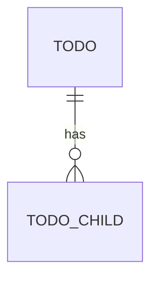

# Data Model — ruuma

**Version:** 0.1 (scaffold)
**Date:** 31 July 2026

PostgreSQL 16. Hand-written SQL, no ORM. UUIDv7 primary keys (BR-1.2.1). Money
as `BIGINT` (BR-1.1.1). Timestamps `timestamptz` in UTC (BR-1.3.1).

---

## 1. ERD

> TODO(domain): entity-relationship diagram (mermaid) once the core nouns exist.

---

## 2. Tables

> TODO(domain): one subsection per table — columns, types, constraints, indexes,
> and the BR-x.y rules each column enforces.

---

## 3. Migration notes

- Migrations live in `db/migrations/NNNN_name.up.sql` + `.down.sql`, embedded via
  `db/embed.go`, forward-only in production.
- Reference tables and seed data go in their own numbered migration.
- Append-only / audit tables (if any) get a dedicated migration with the
  no-update/no-delete constraints spelled out.
