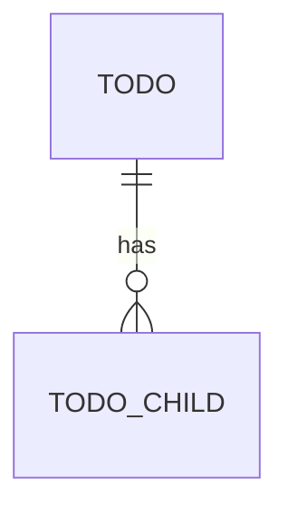

# Data Model — ruuma

**Version:** 0.1 (scaffold)
**Date:** 31 July 2026

PostgreSQL 16. Hand-written SQL, no ORM. UUIDv7 primary keys (BR-1.2.1). Money
as `BIGINT` (BR-1.1.1). Timestamps `timestamptz` in UTC (BR-1.3.1).

---

## 1. ERD

> TODO(domain): entity-relationship diagram (mermaid) once the core nouns exist.



---

## 2. Tables

> TODO(domain): one subsection per table — columns, types, constraints, indexes,
> and the BR-x.y rules each column enforces.

### 2.1 `sys_parameters` (system configuration)

Holds every value that can change without a deploy (company phone/email/address,
tax rate, thresholds, feature toggles). Exposed via full CRUD (list+search,
create, read, update, delete) behind an admin permission. See BR-1.4.

```sql
CREATE TABLE sys_parameters (
  id          UUID PRIMARY KEY,                      -- UUIDv7 (BR-1.2.1)
  key         TEXT NOT NULL UNIQUE,                  -- e.g. 'company.phone'
  value       TEXT NOT NULL,                         -- stored as text; typed on read
  data_type   TEXT NOT NULL DEFAULT 'string',        -- string|int|bool|decimal|json
  description TEXT,
  is_secret   BOOLEAN NOT NULL DEFAULT false,        -- masked in UI/logs when true
  updated_by  UUID,
  created_at  TIMESTAMPTZ NOT NULL DEFAULT now(),
  updated_at  TIMESTAMPTZ NOT NULL DEFAULT now()
);
CREATE INDEX idx_sys_parameters_key ON sys_parameters (key);
```

---

## 3. Migration notes

- Migrations live in `db/migrations/NNNN_name.up.sql` + `.down.sql`, embedded via
  `db/embed.go`, forward-only in production.
- Reference tables and seed data go in their own numbered migration.
- Append-only / audit tables (if any) get a dedicated migration with the
  no-update/no-delete constraints spelled out.
